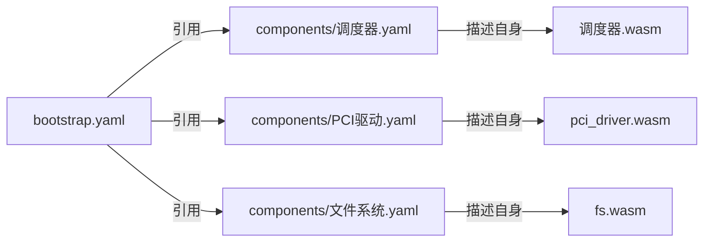
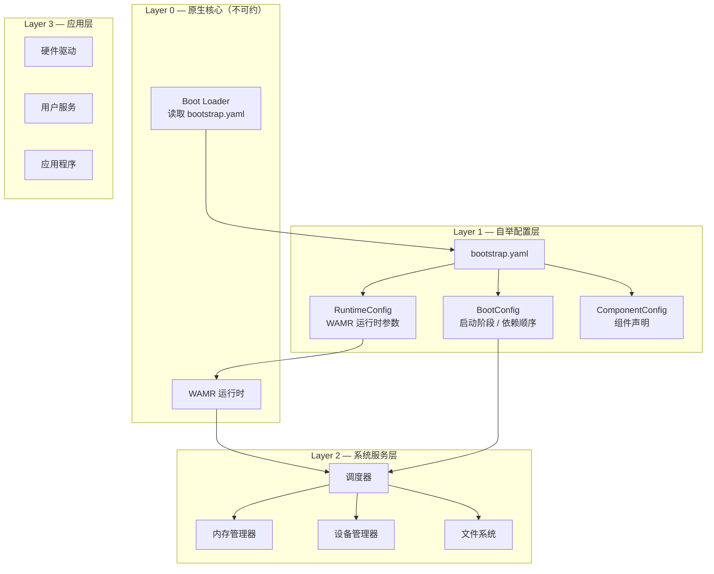

# 一多 OS 自举架构参考

## 核心原则

自举操作系统 = 一份 bootstrap.yaml + 一个 WAMR + N 个 Wasm 组件

其中每个组件都有自己的配置文件（`configs/components/*.yaml`），自我描述其类型、接口、依赖和来源。`bootstrap.yaml` 只负责编排——引用组件配置、声明启动顺序和运行时参数。



## 四层架构



## 包依赖关系

```
runtime (main)          ← wasm-gc / native 双目标
├── runtime/scheduler   ← 双目标：调度器核心
├── runtime/component   ← 双目标：WasmRuntime 接口
│   ├── WasmRuntime 函数表
│   ├── create_simulated() ← L0 模拟模式
│   └── from_fields()     ← 外部构造器
├── runtime/core        ← 双目标：消息/内存/工具
├── runtime/config      ← 双目标：递归 YAML 解析器
│   ├── YamlNode        ← 递归中间表示（Scalar/Mapping/Seq）
│   ├── parse_yaml()    ← 递归 YAML 解析入口
│   ├── parse_bootstrap_yaml() ← bootstrap.yaml 解析
│   └── YiduoBootstrapConfig ← 完整 YAML 配置
├── runtime/wamr        ← ★ 仅 native：WAMR FFI 绑定
│   ├── create_wamr()   ← L2 WAMR 运行时工厂
│   ├── c_src/          ← C 胶水层（wamr_adapter + native_imports）
│   └── wamr_wbtest.mbt ← 7 个集成测试

tools/                      ★ 仅 native：自举工具集
└── yaml_query/          从组件 YAML 递归提取构建元数据输出 JSON
    ├── main.mbt         入口：读取 yq_input.txt → parse_yaml → extract_build_metadata
    └── moon.pkg         依赖 config/fs/core 包
```

## 各层详解

### Layer 0 — 原生核心

WAMR 运行时和 Boot Loader 是唯一不可自举的部分。Wasm 的執行者不能自己執行自己——这是物理限制，非设计缺陷。

- `runtime/wamr/` 包通过 `extern "C"` 调用 WAMR C 库
- C 胶水层（`wamr_adapter.c` + `native_imports.c`）提供桩实现
- 真实 WAMR 库（`libvmlib.a`）在后续通过 `cc-link-flags` 链接
- `supported_targets = ["native"]` 避免 wasm-gc 目标编译 FFI 代码

### Layer 1 — 自举配置

`bootstrap.yaml` 是系统的根配置，包含三个顶级节：

```yaml
runtime:                          # Wasm 运行时参数
  max-components: 32
  max-memory-per-instance: 64
  runtime-type: simulated         # simulated | wamr

bootstrap:                        # 启动流程
  mode: minimal
  log-level: info
  first-component: wasm-runtime

components:                       # 组件声明
  - name: scheduler
    type: native
    required: true
```

对应 MoonBit 类型：

```moonbit
pub struct RuntimeConfig {
  max_components : Int
  max_memory_per_instance : Int
  runtime_type : String
}

pub struct AppConfig {
  api_version : String
  kind : String
  metadata : Metadata
  spec : Spec
  runtime : RuntimeConfig?   // 可选，默认 simulated
}
```

### Layer 2 — 系统服务层

当前状态：
- 调度器为 native（MoonBit 代码，非 Wasm）
- 组件管理器为 native
- 最终目标：调度器编译为 Wasm，作为第一个被 Boot Loader 加载的组件

### Layer 3 — 组件层

所有业务组件通过 WIT 接口注册到调度器，当前支持：
- `Native`：同进程函数指针调用（~2ns）
- `Core`：系统核心组件
- `Wasm`：通过 `WasmRuntime` 函数表调用（模拟模式下 ~2ns，WAMR 下 ~500ns）

## 自举启动流程

```
1. Boot Loader 读取 bootstrap.yaml
2. 解析 RuntimeConfig → 初始化 WAMR 运行时
3. 解析 BootConfig → 确定启动阶段顺序
4. 加载调度器组件（当前为 native，最终为 Wasm）
5. 调度器接管后续组件生命周期管理
```

当前 `bootstrap.mbt` 的实现：

```moonbit
fn main {
  // Step 1: 初始化调度器
  let scheduler = @scheduler.Scheduler::create().set_debug_log(false)

  // Step 2: 注册核心组件
  let info = @scheduler.ComponentInfo::create_simple(...)
  let (scheduler, _core_id) = scheduler.register(info)

  // Step 3: 加载自举配置
  let config = @config.load_bootstrap()

  // Step 3a: 运行时初始化（从配置驱动）
  let rt_config = match config.runtime {
    Some(rc) => rc
    None => @config.RuntimeConfig::default()
  }
  let wasm_rt = @component.WasmRuntime::create_simulated(
    rt_config.max_components,
  )
  scheduler = scheduler.set_wasm_runtime(wasm_rt)

  // Step 4: 注册组件
  for c in config.spec.components { ... }
}
```

## 三层运行时演进

| 层 | 名称 | 实现 | 状态 |
|----|------|------|------|
| **L0** | 模拟运行时 | `create_simulated()` → NativeMessageHandler 回调 | ✅ |
| **L1** | 接口抽象 | `WasmRuntime` 函数表定义 + Scheduler 集成 | ✅ |
| **L2** | 外部运行时 | WAMR FFI 绑定（`runtime/wamr` 包，仅 native） | ✅ stub 就绪 |

## 阶段性迁移路线

### Phase 1 ✅（当前）
- RuntimeConfig 接入 bootstrap.yaml
- 自举启动流程从配置驱动运行时初始化
- WAMR 包拆分为独立 native-only 包

### Phase 2（下一步）
- 调度器接口 WIT 化
- 启动阶段（boot phases）提取到 bootstrap.yaml
- AppConfig 扩展 boot 字段

### Phase 3（终极）
- 调度器编译为 Wasm 组件
- Boot Loader 作为唯一 native 核心
- 调度器自举加载后续所有组件

## 关键类型定义

```moonbit
// WasmRuntime 函数表
pub struct WasmRuntime {
  invoke     : (Int, Int, @core.SmallPayload) -> Unit
  register   : (Int, NativeMessageHandler) -> Unit
  load       : (Int, Bytes) -> Result[Unit, String]
  deallocate : (Int) -> Unit
}

// RuntimeConfig 自举配置
pub struct RuntimeConfig {
  max_components : Int           // 最大 Wasm 实例数
  max_memory_per_instance : Int  // 每实例内存上限（MB）
  runtime_type : String          // "simulated" | "wamr"
}

// 完整启动配置
pub struct YiduoBootstrapConfig {
  system : SystemMeta
  chain : ChainConfig
  components : Array[ComponentEntry]
  bootstrap : BootstrapConfig
  runtime : RuntimeConfig?
}
```

## 测试覆盖

| 目标 | 测试数 | 说明 |
|------|-------|------|
| wasm-gc | 27 | 原生调度 + 模拟运行时 |
| native | 36 | 上述 + 9 个 WAMR 集成测试 |

WAMR 测试覆盖：
- `wamr_runtime_create`：运行时创建
- `wamr_load_stub_returns_error`：stub 模式加载返回错误
- `wamr_invoke_unloaded_no_crash`：未加载时调用不崩溃
- `wamr_deallocate_unloaded_no_crash`：未加载时释放不崩溃
- `wamr_load_out_of_bounds_error`：越界 comp_id 错误处理
- `wamr_scheduler_integration`：WAMR 与调度器集成
- `wamr_scheduler_set_wasm_runtime`：完整消息处理链路
- `wamr_stub_mode_output`：stub 模式控制台输出验证
- `wamr_real_mode_output`：real 模式控制台输出验证

## 自举构建流程

```
1. Build Loader (build_wamr.ps1) 读取 bootstrap.yaml → 确定实现名称
2. 调用 yaml_query 工具 → 递归解析 wamr-runtime.yaml
3. yaml_query 输出构建元数据 JSON（库路径、包含路径、系统库、链接选项）
4. Build Loader 从 JSON 派生所有构建参数
5. 动态生成 runtime/wamr/moon.pkg（cc-flags + cc-link-flags）
6. 生成 wamr_config.h（控制编译期 WAMR_FORCE_STUB）
7. MoonBit 编译时 __has_include 自检 + WAMR_AVAILABLE 宏
```

## 递归 YAML 解析器

`runtime/config/config_loader.mbt` 实现了纯 MoonBit 递归 YAML 解析器：

| 类型 | 说明 |
|------|------|
| `YamlScalar(String)` | 标量值 |
| `YamlMapping(Array[(String, YamlNode)])` | 递归映射 |
| `YamlSeq(Array[YamlNode])` | 递归序列 |

查询辅助函数（全部 pub）：

| 函数 | 说明 |
|------|------|
| `get_scalar(node, key)` | 获取 scalar 值 |
| `get_mapping(node, key)` | 获取子 mapping |
| `get_seq(node, key)` | 获取子 sequence |
| `seq_scalars(node)` | 遍历 seq 中的 scalar |
| `seq_mappings(node)` | 遍历 seq 中的 mapping |

## 常见问答

### Q: WAMR 为什么不注册为 bootstrap 组件？
WAMR 是执行 Wasm 字节码的引擎，不能是 Wasm 组件（无限递归）。它作为 native 库编译链接。但 WAMR 的**所有构建参数**（库路径、包含路径、系统库、链接选项）通过组件配置文件 `configs/components/wamr-runtime.yaml` 声明，由 `build_wamr.ps1` 动态读取并生成 `moon.pkg`，完全符合自举编程精神——系统读取自身配置决定行为。

### Q: 为什么 wasm-gc 目标不支持 WAMR？
MoonBit 的 wasm-gc 后端不支持 `extern "C"`。WAMR 包通过 `supported_targets = ["native"]` 隔离，不会在 wasm-gc 目标下编译。

### Q: 如何从 simulated 切换到真实的 WAMR？
1. 运行 `.\scripts\build_wamr.ps1` → 自动完成以下步骤：
   - 读取 `configs/bootstrap.yaml` 确定实现（wamr-real）
   - 调用 `yaml_query` 工具递归解析 `wamr-runtime.yaml`
   - 从配置派生所有构建参数
   - 下载/编译 WAMR 库 `liblibiwasm.a`
   - 动态生成 `runtime/wamr/moon.pkg`（含 cc-flags + cc-link-flags）
2. 运行 `moon test --target native` 验证

### Q: 什么是递归 YAML 解析？为什么需要它？
递归 YAML 解析意味着解析器将 YAML 文件转换为树状结构（`YamlNode`），而不是平面文本扫描。`config` 包的 `parse_yaml()` 函数返回嵌套的 `YamlNode`（支持 Scalar / Mapping / Seq 三种节点类型）。`yaml_query` 工具在此树状结构上进行递归查找，直接从组件配置中提取构建参数，替代了原来脆弱的 PowerShell 正则平扫方法，使配置读取更加健壮和可维护。