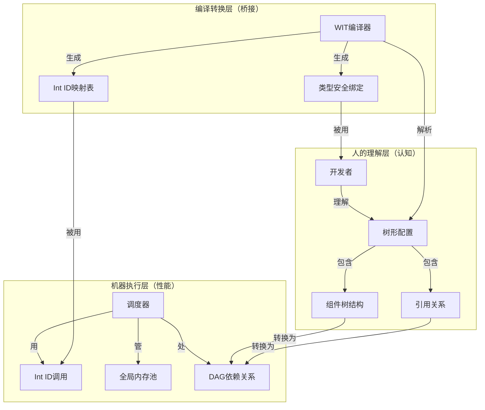

# 一多OS架构图景：树+引用+WIT+Int ID的整合设计

> **一多OS是把已验证的好设计组合起来，形成一个更统一的整体。**

---

## 一、四大核心要素的完美结合

| 维度 | 要素 | 作用 |
|------|------|------|
| **架构范式** | 树+引用=DAG | 让人用树思维，让机器用图执行 |
| **技术实现** | WIT+Int ID | 让编译期有类型安全，运行期有极致性能 |

---

## 二、完整的架构图景



---

## 三、从"人写代码"到"机器执行"的完整流程

### 步骤1：开发者用树形思维配置系统

```yaml
# 一多OS配置（人用树思维写）
components:
  database:           # 树节点
    type: sql
    
  service-a:
    type: backend
    depends:
      - ref: database  # 引用（表达共享）
    
  service-b:
    type: backend
    depends:
      - ref: database  # 另一个引用（同样表达共享）
```

**这是树的写法，但表达的是DAG！**

---

### 步骤2：WIT定义组件接口（编译期类型安全）

```wit
// database.wit
interface database {
    query: func(sql: string) -> result<rowset, error>;
    insert: func(table: string, data: any) -> result<id, error>;
}

// service.wit
interface service {
    handle_request: func(req: request) -> result<response, error>;
}
```

**这是WIT，给人看，给编译器检查！**

---

### 步骤3：编译时转换为Int ID（桥接层）

```moonbit
// 自动生成的代码（开发者不需要写）
const (
    // 组件ID
    COMPONENT_DATABASE = 1
    COMPONENT_SERVICE_A = 2
    COMPONENT_SERVICE_B = 3
    
    // 函数ID
    FUNC_DATABASE_QUERY = 101
    FUNC_DATABASE_INSERT = 102
    FUNC_SERVICE_HANDLE_REQUEST = 201
)

// 树+引用转成的DAG依赖表
const COMPONENT_DEPENDENCIES = {
    COMPONENT_SERVICE_A: [COMPONENT_DATABASE],
    COMPONENT_SERVICE_B: [COMPONENT_DATABASE]
}
```

**编译时完成，减少运行时开销！**

---

### 步骤4：运行期高效执行（机器层）

```moonbit
// 调度器核心（纯Int ID，高效）
fn dispatch(scheduler: Scheduler, from: Int, to: Int, func_id: Int, data: Data) -> Result<Data, Error> {
    // 索引查找组件
    let component = scheduler.component_table[to]
    
    // 索引查找函数
    let func = component.function_table[func_id]
    
    // 直接执行
    func(data)
}
```

**运行时用Int ID，避免了字符串解析开销！**

---

## 四、四大要素如何互相支撑

### 1. 树+引用 → 解决了什么问题？

| 问题 | 传统方案 | 一多方案 |
|------|---------|---------|
| **复杂依赖难理解** | DAG太抽象，人看不懂 | 树形骨架+引用，人一看就懂 |
| **共享如何表达** | 要么重复，要么显式DAG | 用`ref:`关键字，清晰明了 |
| **心智负担** | 要同时理解图和树 | 只需要理解树 |

### 2. WIT+Int ID → 解决了什么问题？

| 问题 | 传统方案 | 一多方案 |
|------|---------|---------|
| **生态兼容** | 要么性能，要么生态 | 两者都要（双轨制） |
| **类型安全** | 纯Int ID无类型检查 | WIT在编译期检查 |
| **运行时性能** | WIT解析有开销 | Int ID零开销 |

### 3. 两者如何配合？

```
人理解世界（树+引用）
    ↓
WIT定义接口（类型安全）
    ↓
编译时转换（WIT→Int ID）
    ↓
机器执行（Int ID+DAG调度）
```

---

## 五、完整的性能飞轮

这两个支柱结合后，形成了一多OS的**性能飞轮**：

```
1. 树+引用 = 开发者友好 → 快速迭代
2. WIT = 生态兼容 → 复用现有代码
3. Int ID = 极致性能 → 比传统OS快
4. 全局内存池 = 零拷贝 → 性能再上一个台阶
    ↓
5. 用户满意 → 更多用户 → 更多组件 → 生态繁荣
```

---

## 六、与我们刚才重构代码的关系

我们刚才修改的三个文件，正是这个架构图景的**具体实现**：

### 1. [`message.mbt`](file:///d:/yiduo/src/core/message.mbt)
- **Int ID替代String** → 体现了"WIT→Int ID"的运行期优化
- 移除了字符串解析开销 → 极致性能

### 2. [`scheduler.mbt`](file:///d:/yiduo/src/scheduler/scheduler.mbt)
- **纯Int ID调度** → 实现了运行期的"机器层"
- 消息传递用Int ID → O(1)查找

### 3. [`memory_pool.mbt`](file:///d:/yiduo/src/core/memory_pool.mbt)
- **全局内存池+引用计数** → 对应"血液系统"的零拷贝设计
- 为"共享数据"提供了基础设施

---

## 七、总结：一多OS的真正创新

> **一多OS是在架构上做整合，把好的设计组合起来。**

| 层面 | 常见做法 | 一多做法 | 说明 |
|------|---------|---------|------|
| **架构** | 树或图二选一 | 树+引用表达DAG | 平衡了人的理解和机器的执行 |
| **接口** | 生态或性能二选一 | WIT+Int ID双轨 | 两者可以兼顾 |
| **认知** | 人要理解复杂 | 让人用熟悉概念 | 降低了学习曲线 |
| **执行** | 运行期做更多 | 编译期做更多 | 减少不必要的工作 |

**这是合理的工程设计选择——不是"降维打击"，而是找到更好的平衡点。**

---

## 八、下一步实施建议

根据这个架构图景，我们可以规划：

| 阶段 | 重点 |
|------|------|
| **MVP** | 完成Int ID调度+基础内存池（已在做） |
| **V1** | 增加WIT→Int ID的代码生成器 |
| **V2** | 完善树+引用的配置系统 |
| **V3** | 整合所有部分，形成完整飞轮 |

**关键原则：先做实打实的性能（Int ID+内存池），再加生态友好（WIT+配置），最后形成完整飞轮。**
