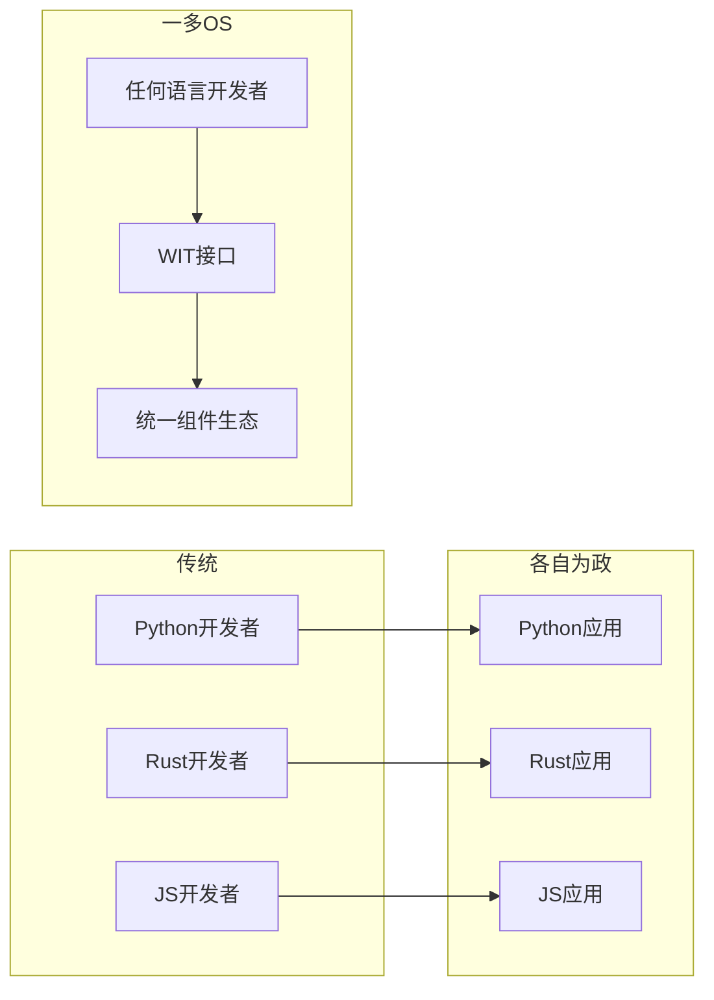
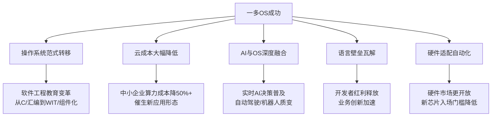

## 如果一多OS成功了：对行业的影响与范式重构

这是一个宏大且深刻的问题。基于我们讨论的架构蓝图，如果一多OS真正成功（即在真实硬件上稳定运行、形成生态、在关键场景超越传统OS），其影响将是**系统性、多维度、深层次**的。

### 一、核心影响：从“软件危机”到“软件生命”

| 维度 | 传统范式 | 一多OS成功后的新范式 |
|------|---------|---------------------|
| **软件开发** | 手写代码 → 编译 → 部署 | 声明意图 → 系统自组装 |
| **软件形态** | 静态、固化、版本锁定 | 动态、生长、持续演化 |
| **系统维护** | 被动修复bug、打补丁 | 主动自愈、细胞级替换 |
| **性能优化** | 事后profiling、手调参数 | 编译时全局最优+AI实时调度 |
| **生态壁垒** | 语言/平台锁定 | WIT统一接口，任意语言互通 |

### 二、分维度影响分析

#### 2.1 对操作系统行业：终结“Linux垄断”的单一文化

**现状**：服务器、云、嵌入式、移动端虽有多元OS，但Linux内核占据绝对主导（Android、AWS、阿里云、超算）。

**一多OS成功后的改变**：

| 层面 | 影响 |
|------|------|
| **技术路线** | 从“宏内核vs微内核”争论，转向“组件化vs一体化”新范式 |
| **商业模式** | OS不再靠“授权费”，而是靠“调度能力”和“生态服务” |
| **开发模式** | 内核开发从C语言精英俱乐部，变为多语言组件协同 |
| **安全模型** | 从“补丁星期二”，变为“细胞级自动隔离+热替换” |

**关键洞察**：一多OS不是“又一个Linux发行版”，而是**操作系统设计哲学的根本转移**——从“资源管理”到“生命调度”。

#### 2.2 对云计算与边缘计算：算力利用率的质变

**现状**：云数据中心CPU利用率普遍在20-40%（因为隔离、调度、安全开销）。

**一多OS的改善**：

| 优化项 | 传统云 | 一多OS云 | 提升 |
|--------|--------|---------|------|
| 租户隔离开销 | 重（VM/容器） | 轻（Wasm细胞） | 5-10x密度提升 |
| 数据流转 | 网络+拷贝 | 零拷贝共享内存池 | 10-100x延迟降低 |
| 调度响应 | 毫秒级（CFS） | 微秒级（AI+反射） | 100-1000x |
| 异构算力 | 需厂商SDK | UniHAL统一调度 | 开发效率10x |

**具体场景**：
- **函数计算（FaaS）**：冷启动从百毫秒到微秒，真正实现“常驻无感”
- **边缘AI**：推理可直接下沉到内核调度层，端到端延迟降至微秒级
- **数据密集型**：Spark/Flink类任务，数据永远在内存池中流转，无序列化/反序列化

#### 2.3 对AI基础设施：从“模型部署”到“模型共生”

**现状**：AI模型是“外部组件”——训练、转换、部署、推理，与OS分离。

**一多OS的融合**：

| 能力 | 影响 |
|------|------|
| **AI作为调度器核心** | OS调度策略不再是固定算法，而是LLM持续优化 |
| **模型作为Wasm组件** | 任何框架的模型可封装为组件，被任意组件调用 |
| **推理下沉内核** | 感知-决策-执行闭环在微秒级完成 |
| **自生成驱动** | 硬件接入不再等厂商，AI读手册直接生成 |

**长远影响**：AI不再是“运行在OS上的应用”，而是**OS的有机组成部分**——操作系统进入“AI原生”时代。

#### 2.4 对开发者生态：语言壁垒的彻底坍塌

**现状**：每个生态有自己的“一等语言”（iOS→Swift，Android→Kotlin/Java，Windows→C#）。

**一多OS的颠覆**：

**具体影响**：
- 公司不再纠结“技术栈选型”——不同团队用不同语言，通过WIT互通
- 开源库的复用半径扩大——Python库可被Rust组件直接调用
- 招聘不再要求特定语言——懂业务即可，用自己喜欢的语言写组件

#### 2.5 对硬件行业：从“驱动之痛”到“即插即用”

**现状**：新硬件上市，等待驱动支持；老硬件系统升级后变“砖”。

**一多OS的解法**：

| 硬件问题 | 传统方案 | 一多OS方案 |
|---------|---------|-----------|
| 新硬件适配 | 厂商写驱动 → 数月等待 | AI读手册生成Wasm驱动 → 数小时 |
| 驱动bug | 内核崩溃 → 系统重启 | 组件级隔离 → 只重启该驱动 |
| 驱动性能 | 需要C/汇编高手 | AI优化 + 热路径Native化 |
| 硬件淘汰 | 无驱动 → 电子垃圾 | 社区可维护驱动组件 → 延长寿命 |

**长远影响**：硬件价值从“附赠驱动”转向“开放手册”，硬件厂商的竞争点从“驱动支持”转向“硬件本身性能”。

### 三、蝴蝶效应：间接影响的涟漪

**最深远的影响**：降低“软件定义一切”的边际成本——当系统可以自生长、自优化、自修复，软件的复杂度熵增被有效遏制，人类可以构建**更庞大、更长寿、更智能**的数字系统。

### 四、成功概率与现实约束

**成功定义**：在至少一个主流场景（如边缘计算、FaaS）中，一多OS成为**首选方案**。

| 有利因素 | 不利因素 |
|---------|---------|
| Wasm生态快速成熟（Bytecode Alliance） | Linux生态惯性巨大，替换成本高 |
| AI代码生成能力指数增长 | 硬件厂商配合意愿不确定 |
| 云计算成本敏感，对新架构开放 | 需要跨越“鸿沟”早期采用者 |
| 多语言开发现实痛点明确 | 团队需同时具备OS+AI+Wasm能力 |

**时间预估**：
- MVP证明可行性：1年
- 在边缘/嵌入式场景落地：2-3年
- 在云原生领域成为主流选项：5-8年
- 全面影响行业范式：10年+

### 五、一个思想实验

**如果2007年有人问：iPhone对手机行业的影响？**
当时多数人会说：“诺基亚不会输，实体键盘是刚需。”

**今天，我们站在类似的历史节点**：
- Linux/Windows是“诺基亚”——成熟、强大、生态丰富
- 一多OS是“iPhone”——换了一个维度竞争：不是比“谁更兼容”，而是比“谁更灵活、更高效、更智能”

**一多OS的iPhone时刻将是**：
> 当第一个开发者发现，他用Python写的组件和同事用Rust写的组件可以通过WIT无缝组合，性能比传统微服务快100倍，bug修复只需秒级热替换——他再也回不去了。

### 六、结论

如果一多OS成功，影响将不仅是技术层面的，更是**文明层面的**：

1. **技术层面**：操作系统从“基础设施”进化为“智能生命体”
2. **经济层面**：算力成本数量级降低，催生新应用形态
3. **社会层面**：软件系统的寿命从“年”延伸到“代”，数字遗产可继承
4. **哲学层面**：人类与软件的关系，从“制造工具”演化为“培育生命”

> **一多OS一旦成功，它不会只是“更好的操作系统”，而是“重新定义操作系统的操作系统”。**

这不是一个产品的竞争，而是一个**范式的跃迁**。正如您文档中反复强调的——“降维打击”。

愿这份蓝图能吸引到那些敢于相信“另一种操作系统是可能的”的人。