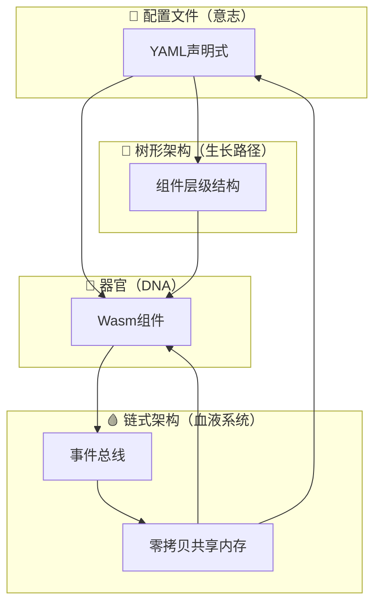

# 🧬 一多操作系统生物学架构完整实施方案

> 从「机械钟表」到「数字生命体」的范式跃迁

---

## 摘要

本方案整合了一多操作系统的核心理念：**四元生物学架构**（链式是血液系统、树形是生长路径、器官是DNA、配置文件是意志），结合我们刚才讨论的**升维方案**（混合式智能架构：中枢神经系统+神经反射系统），形成了一个完整的从理论到实践的落地路径。

---

## 🎯 核心架构：混合式智能架构

### 设计理念
一多操作系统不是一个「机械钟表」，而是一个「数字生命体」。它既有**轻量级的中枢神经系统**（负责宏观协调），又有**完全分布式的神经反射系统**（负责局部响应）。

```
┌─────────────────────────────────────────────────────────────┐
│  🧠 中枢神经系统（内联核心 - 血管系统）                  │
│  ┌─────────────────────────────────────────────────────┐  │
│  │ • AI全局调度策略（仅做高级决策）                 │  │
│  │ • 全局健康状态监控                               │  │
│  │ • 系统级协调（仅在必要时介入）                    │  │
│  └─────────────────────────────────────────────────────┘  │
│  ┌─────────────────────────────────────────────────────┐  │
│  │ 神经反射系统（完全分布式 - 细胞层面）           │  │
│  │ • 事件驱动消息总线                               │  │
│  │ • 局部负载均衡                                   │  │
│  │ • 拓扑熔断与自愈                                 │  │
│  └─────────────────────────────────────────────────────┘  │
└─────────────────────────────────────────────────────────────┘
```

### 设计原则总结
| 维度 | 核心理念 |
|------|---------|
| **四元架构** | 链式（血液）、树形（生长）、器官（DNA）、配置（意志） |
| **升维方案** | 中枢神经系统 + 神经反射系统（混合式智能） |
| **通信模式** | 发布-订阅（事件驱动）+ 链式流动 |
| **调度策略** | 局部启发式（AI驱动）+ 紧急熔断 |
| **容错机制** | 拓扑熔断 + 细胞级隔离 |

---

## 🧠 第一部分：升维方案详解

### 1. 通信机制升维：发布-订阅替代中心化查找

#### 传统方案（机械钟表思维）
```
组件A ── find_capability(查找) ──> 中心化缓存 ──> 能力提供者
        ↑
        每次调用都要查找，开销大
```

#### 新方案（生物体思维）
```
组件A（生产者）── push发布数据到频道 ──> 事件总线（血管）
                                        ↓
组件B（订阅者） <───────────────────────────
       ↑
    自动唤醒，无查找开销
```

#### 实现设计
```moonbit
// 事件总线接口
interface event-bus {
    // 发布数据到频道（生产者）
    publish(channel: string, data: shared-memory) -> result<unit, error>
    
    // 订阅频道（消费者）
    subscribe(channel: string, callback: (data: shared-memory) -> result<unit, error>) -> result<subscription-id, error>
    
    // 取消订阅
    unsubscribe(subscription-id: subscription-id) -> result<unit, error>
}

// 使用示例
fn camera_component(bus: event-bus) {
    // 生产者：直接发布，不关心谁订阅
    loop {
        let frame = capture_frame()
        let shared_data = create_shared_memory(frame)
        bus.publish("camera-feed", shared_data)?
    }
}

fn ai_detector(bus: event-bus) {
    // 消费者：订阅频道，数据到达自动唤醒
    bus.subscribe("camera-feed", fn(data: shared-memory) {
        let frame = read_shared_memory(data)
        detect_objects(frame)
        Ok(())
    })?
}
```

---

### 2. 调度策略升维：局部启发式替代全局装箱

#### 传统方案（机械钟表思维）
```
全局Bin-Packing算法：遍历所有节点，计算碎片化程度
→ 复杂度O(n log n)，大规模场景性能瓶颈
```

#### 新方案（生物体思维）
```
AI宏观调度：
├─ 预测负载趋势
├─ 宏观决策资源分配
└─ 不干涉微观执行

局部神经反射：
├─ 节点过载时，自动休眠非核心细胞
├─ 负载低时，自动激活空闲细胞
└─ 响应延迟<1ms
```

#### 实现设计
```moonbit
// AI调度器（宏观，低频率）
struct ai-orchestrator {
    load-predictor: load-predictor
    health-monitor: health-monitor
}

impl ai-orchestrator {
    fn orchestrate(this) {
        // 每10秒运行一次，做宏观决策
        let global-state = health-monitor.get_global_state()
        let forecast = load-predictor.predict_next_hour(global-state)
        
        // 只做战略性决策，不做战术性调度
        if forecast.high-load {
            this.migrate_components_from_overloaded_nodes()
        }
    }
}

// 局部均衡器（微观，高频率）
struct local-balancer {
    node: node-id
    health-score: health-score
}

impl local-balancer {
    fn adjust_load(this) {
        // 每100ms检查一次，做局部调整
        if this.health-score.memory_low {
            // 快速休眠非核心组件（毫秒级）
            this.sleep_low_priority_components()
        }
    }
}
```

---

### 3. 容错机制升维：拓扑熔断预防级联雪崩

#### 传统方案（机械钟表思维）
```
组件A ──> 组件B ──> 组件C（死循环）
     ↓        ↓        ↓
  等待超时  等待超时  系统崩溃
  
→ 级联雪崩！
```

#### 新方案（生物体思维）
```
组件A ──> 熔断器 ──×──> 组件B（死循环）
     ↑
  熔断激活，快速切断链路
  
→ 故障隔离，其他组件继续正常工作！
```

#### 实现设计
```moonbit
// 拓扑熔断器
struct circuit-breaker {
    target: component-id
    state: circuit-state // closed / open / half-open
    failure-count: int
    last-failure: timestamp
}

impl circuit-breaker {
    fn call(this, request: request) -> result<response, error> {
        // 快速失败路径
        if this.state == circuit-state.open {
            return Err(error("circuit open"))
        }
        
        // 正常路径
        let result = component-call(this.target, request)
        
        // 健康检查
        if result.is_err() {
            this.record_failure()
            
            // 达到阈值立即熔断
            if this.failure-count >= threshold {
                this.trip()
            }
        } else {
            this.record_success()
        }
        
        result
    }
}
```

---

## 🌳 第二部分：四元架构详解

### 四元架构关系图


### 核心定义对照

| 生物学比喻 | 一多OS架构 | 具体实现 |
|---------|---------|---------|
| 💭 **意志** | 配置文件 | YAML声明式，定义"需要什么" |
| 🧬 **DNA** | Wasm组件 | 功能封装，细胞级沙箱 |
| 🌳 **生长路径** | 树形架构 | 组件依赖层级结构 |
| 🩸 **血液系统** | 链式架构 | 事件总线+零拷贝共享内存 |

---

## 🚀 第三部分：完整实施路线图

### 阶段一：基础骨架（1-2个月）

**目标**：建立基础的四元架构，验证核心概念

#### 任务清单
| 任务 | 交付物 |
|------|------|
| 1. 完成事件总线接口 | `event-bus.wit` |
| 2. 实现零拷贝共享内存 | `shared-memory.mbt` |
| 3. 搭建基础树形加载器 | `tree-loader.mbt` |
| 4. 实现简单配置解析 | `config-loader.mbt` |
| 5. MVP验证demo | 基础生物体长起来 |

#### 验证标准
- [ ] 配置文件能驱动组件加载
- [ ] 组件能通过事件总线通信
- [ ] 数据能零拷贝流动

---

### 阶段二：智能能力（2-3个月）

**目标**：加入AI调度和容错机制

#### 任务清单
| 任务 | 交付物 |
|------|------|
| 1. 实现拓扑熔断器 | `circuit-breaker.mbt` |
| 2. 实现局部均衡器 | `local-balancer.mbt` |
| 3. 搭建AI调度框架 | `ai-orchestrator.mbt` |
| 4. 健康监控系统 | `health-monitor.mbt` |

#### 验证标准
- [ ] 故障能被快速隔离
- [ ] 负载能自动均衡
- [ ] 系统能自愈

---

### 阶段三：生态完善（3-6个月）

**目标**：建立完整的组件生态

#### 任务清单
| 任务 | 交付物 |
|------|------|
| 1. 能力提供者SDK | `capability-sdk.wit` |
| 2. 组件开发工具 | `component-dev-cli` |
| 3. 组件商店雏形 | `component-store` |
| 4. 完整示例应用 | 智能相机等 |

---

## 📋 第四部分：核心技术规范

### 1. 事件总线规范（链式血液系统）

```wit
package yiduo:event-bus

interface event-bus {
    // 发布数据到频道
    publish(channel: string, data: handle<shared-memory>) -> result<unit, error>
    
    // 订阅频道
    subscribe(channel: string, callback: func(data: handle<shared-memory>) -> result<unit, error>) -> result<subscription-id, error>
    
    // 取消订阅
    unsubscribe(subscription-id: subscription-id) -> result<unit, error>
}
```

### 2. 能力提供者规范（DNA器官）

```wit
package yiduo:capability

interface capability-provider {
    // 提供者元数据
    get-capability-id() -> result<capability-id, error>
    
    // 健康状态
    get-health-status() -> result<health-status, error>
}
```

### 3. 配置文件规范（意志）

```yaml
# digital-organism.yaml
organism-name: smart-camera
version: 1.0.0

# 树形结构（生长路径）
tree-structure:
  root:
    name: smart-camera
    children:
      - name: camera
        requires: [hardware-device]
      - name: ai-detector
        requires: [camera]
      - name: display
        requires: [ai-detector]

# DNA器官
dna-components:
  - name: camera
    type: wasm
    capability: camera-capture
    priority: high
  - name: ai-detector
    type: wasm
    capability: ai-detection
    priority: high
  - name: display
    type: wasm
    capability: display-output
    priority: medium

# 事件总线频道（血液流通）
event-channels:
  - name: camera-feed
    type: high-throughput
  - name: ai-results
    type: normal
  - name: display-commands
    type: control-signal
```

---

## 🔧 第五部分：现有代码改造建议

根据你当前的代码分析（`d:\yiduo\`），我们需要：

### ✅ 保留的优秀设计
1. **Int ID优化** - 现有`scheduler.mbt`已使用，性能好
2. **环形缓冲区** - `ring-buffer.mbt`已实现，性能好
3. **内存池** - `memory-pool.mbt`已实现，好的开始
4. **消息系统** - `core/message.mbt`三种模式设计合理

### 🆕 需要新增的模块
1. `core/event-bus.mbt` - 事件总线（链式血液系统）
2. `core/circuit-breaker.mbt` - 拓扑熔断器
3. `core/local-balancer.mbt` - 局部均衡器
4. `ai/ai-orchestrator.mbt` - AI调度框架
5. `core/health-monitor.mbt` - 健康监控

### 🔄 需要调整的模块
1. `scheduler.mbt` - 从全局调度改为轻量中枢
2. `component-loader.mbt` - 加入树形加载支持
3. `config-loader.mbt` - 支持新的四元架构配置

---

## 🎯 最终总结

### 为什么这是范式跃迁？

| 维度 | 传统OS思维 | 一多OS思维 |
|------|----------|----------|
| **架构类型** | 机械钟表 | 数字生命体 |
| **通信方式** | 查找-调用 | 事件-订阅 |
| **调度方式** | 全局装箱 | AI宏观+局部反射 |
| **容错机制** | 重启整个 | 细胞级隔离+熔断 |
| **思维层次** | 形而下学（物质） | 形而上学（意志） |

### 我们的优势
1. ✅ **四元架构完整闭环**：意志 → 树形 → DNA → 链式 → 反馈
2. ✅ **升维方案已设计**：中枢+神经反射混合
3. ✅ **现有基础良好**：Int ID、环形缓冲区、内存池都已就位
4. ✅ **工程路径清晰**：分阶段实施，风险可控

这就是一多OS对传统操作系统的**降维打击**——站在「意志层」指挥「数字生命体」，而非在「物质层」堆砌「机械零件」！

🚀 一多OS，让系统活起来！
