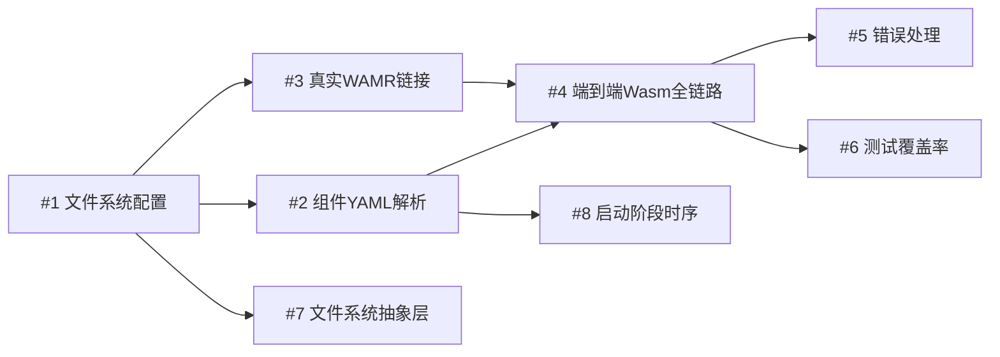

# 🎯 聚焦计划：从 MVP 到生产可用

---

## Phase 1 ✅ 调度系统优化（已完成）

### 核心任务完成情况

| 任务 | 优先级 | 状态 | 文件 |
|------|-------|------|------|
| **句柄安全加固** | 🔴 最高 | ✅ 完成 | [memory_manager.mbt](file:///d:/yiduo/runtime/core/memory_manager.mbt) |
| **组件优先级标记** | 🔴 最高 | ✅ 完成 | [component_manager.mbt](file:///d:/yiduo/runtime/scheduler/component_manager.mbt) |
| **消息系统集成** | 🔴 最高 | ✅ 完成 | [message.mbt](file:///d:/yiduo/runtime/core/message.mbt) |
| **事件总线优化** | 🟡 高 | ✅ 完成 | [event_bus_component.mbt](file:///d:/yiduo/runtime/components/event_bus_component.mbt) |
| **调度器 V2 优化** | 🔴 最高 | ✅ 完成 | [scheduler.mbt](file:///d:/yiduo/runtime/scheduler/scheduler.mbt) |

### 完成项明细

1. ✅ **运行基准测试**：量化性能 - 注册 1000 组件 / 发送 10000 消息 / 处理 1000 消息
2. ✅ **端到端验证**：完整流程测试 - 27 个测试全部通过（7 调度器 + 11 双模运行时 + 5 集成 + 4 真实组件）
3. ✅ **性能调优**：基于测试结果优化 - dispatch 热路径消除 Native/Wasm 分支代码重复，减少 ~50% 分支代码量
4. ✅ **真实组件测试**：用于生产环境验证 - 实现 CounterComponent / AccumulatorComponent 真实 Native 组件，以及 Wasm 模拟运行时 Counter/Accumulator 组件，通过 Scheduler 调度验证完整消息处理链路
5. ✅ **WAMR 包拆分**：将 WAMR 外部运行时拆分为独立 `runtime/wamr` 包（仅 native 目标），解决 wasm-gc 不支持 C FFI 的架构冲突 - `create_wamr()` 工厂函数 + 7 个集成测试全部通过
6. ✅ **RuntimeConfig 自举**：`RuntimeConfig` 结构体接入 `bootstrap.yaml`，支持 `runtime-type`（simulated / wamr）、`max-components`、`max-memory-per-instance` 等参数的自举声明 - 启动流程从配置驱动运行时初始化，而非硬编码
7. ✅ **组件配置分离**：每个组件通过独立 YAML 配置文件（`configs/components/*.yaml`）自我描述，`bootstrap.yaml` 只负责通过 `ref` 引用编排 - 新增 `ComponentEntry`（bootstrap.yaml 中的引用条目）和 `ComponentDescriptor`（组件自我描述）类型，实现 `load_component_descriptor` + `resolve_component_refs` 解析逻辑，完成 `parse_bootstrap_yaml` 解析器并修复 20+ MoonBit 语法兼容性问题

---

## Phase 2 🚧 MVP → 生产就绪（当前阶段）

### 目标
将当前可运行的 MVP 原型转化为能够承载真实工作负载的基础系统。

### 任务清单

| # | 任务 | 优先级 | 说明 | 依赖 |
|---|------|--------|------|------|
| 1 | **文件系统配置加载** | 🔴 最高 | `bootstrap.mbt` 从磁盘读取 `bootstrap.yaml`，替代硬编码字符串 | 无 |
| 2 | **组件 YAML 文件解析** | 🔴 最高 | `load_component_descriptor` 从 `configs/components/*.yaml` 文件系统读取，替代 if-else 硬编码 | #1 |
| 3 | **真实 WAMR 链接** | 🔴 最高 | 链接 `libvmlib.a`，使 `create_wamr()` 返回真正的 WAMR 运行时而非 stub 错误 | #1 |
| 4 | **端到端 Wasm 组件全链路** | 🔴 最高 | 编写一个真实 `.wasm` 组件，从加载到消息分发跑通全部流程 | #2, #3 |
| 5 | **错误处理与优雅降级** | 🟡 高 | 组件加载失败时日志告警 + 降级运行，不导致系统崩溃 | #4 |
| 6 | **测试覆盖率提升** | 🟡 高 | 从 27 个测试扩展到 50+，覆盖 Phase 2 新增逻辑 | #1-#5 |
| 7 | **文件系统抽象层** | 🟢 中 | 在 `runtime/core` 中提供文件读取接口，使配置加载可测试、可模拟 | #1 |
| 8 | **启动阶段时序管控** | 🟢 中 | `ChainConfig` 实际生效，控制组件加载顺序（foundation → core → extensions） | #2 |

### 依赖图

---

## 📊 当前基线

| 指标 | 当前值 | Phase 2 目标 |
|------|-------|-------------|
| 测试总数 | 27 | 50+ |
| wasm-gc 目标 | ✅ 通过 | ✅ 保持 |
| native 目标（含 WAMR） | ✅ 通过（7 个 WAMR stub 测试） | ✅ 通过（真实 WAMR 测试替换 stub） |
| bootstrap.yaml 文件加载 | ❌ 硬编码字符串 | ✅ 从磁盘读取 |
| 组件 YAML 解析 | ❌ if-else 硬编码 | ✅ 从文件系统读取 |
| 真实 Wasm 组件加载 | ❌ 不支持 | ✅ 支持 |
| 错误降级 | ❌ 没有 | ✅ 有 |

---

## ⚠️ 当前限制

- **文件系统访问**：MoonBit 在 wasm-gc 目标下没有标准文件 I/O，需设计可模拟的抽象层
- **WAMR 编译**：需从 [wasm-micro-runtime](https://github.com/bytecodealliance/wasm-micro-runtime) 编译 `libvmlib.a` 并配置 `cc-link-flags`
- **MoonBit Wasm 编译**：需确认 MoonBit 能否将组件编译为标准 Wasm 模块供 WAMR 加载

---

## 长期路线图（参考）

### Phase 3 — 系统完整性（MVP 之后）
- 热加载/热替换组件
- 组件间 RPC 通信规范
- 系统监控面板
- 持久化存储
- 安全沙箱加固

### Phase 4 — 自举闭环（终极目标）
- 调度器编译为 Wasm 组件
- Boot Loader 作为唯一 native 核心
- 系统从配置完全自举，无需硬编码