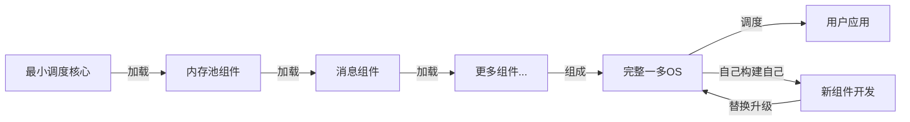

这是一个很好的问题！让我们客观分析一下：

## ⚖️ 客观对比分析

### 静态编译（单wasm/exe）

| 方面 | 优势 | 劣势 |
|------|------|------|
| **性能** | ✅ **更高**（LTO全程序优化、内联、无间接调用） | |
| **启动时间** | ✅ **更快**（无加载、链接开销） | |
| **灵活性** | | ❌ **差**（修改需重新编译） |
| **演进** | | ❌ **慢**（牵一发而动全身） |
| **资源隔离** | | ❌ **差**（bug影响整个程序） |

### 动态调度（一多OS）

| 方面 | 优势 | 劣势 |
|------|------|------|
| **性能** | | ⚠️ **略低**（有少量间接开销） |
| **启动时间** | | ⚠️ **略慢**（需要加载组件） |
| **灵活性** | ✅ **极高**（配置驱动，无需重编） | |
| **演进** | ✅ **快速**（组件可独立替换） | |
| **资源隔离** | ✅ **好**（Wasm沙箱隔离） | |

---

## 💡 真实性能差距（估算）

| 操作 | 静态单exe | 动态调度 | 差距 |
|------|----------|--------|------|
| **函数调用** | 直接跳转 (~1-3 cycles) | 查表+跳转 (~5-10 cycles) | ~2-3x |
| **组件间通信** | 直接调用 | 消息传递+调度 | ~5-10x |
| **整体应用** | 基准 | ~慢20-50% | ~1.2-1.5x |

**关键洞察**：
- 微基准差距大（2-10x）
- 实际应用差距小（1.2-1.5x）
- 因为大部分时间花在实际业务逻辑上，不在调度上

---

## 🎯 什么时候选什么？

### 选静态编译（单exe）：
- ✅ 性能是最高优先级（HFT、游戏引擎）
- ✅ 需求稳定，变化少
- ✅ 团队规模小，不需要多人协作

### 选动态调度（一多OS）：
- ✅ **自举系统**（必须！）
- ✅ 需要快速迭代、频繁变化
- ✅ 系统复杂，需要多人协作
- ✅ 需要故障隔离、灵活组合
- ✅ 性能要求"足够好"，不是"极致"

---

## 🚀 关键：自举系统必须是动态的

### 什么是自举？
自举（Bootstrapping）的核心理念是：**自己使用自己**——

- **用自己编译自己**
- **用自己调度自己**
- **用自己构建自己**
- **用自己演进自己**

系统先启动一个最小核心，然后逐步加载自身组件，最终完整运行。

### 为什么自举必须是动态的？

| 问题 | 静态编译（单exe） | 动态调度（一多OS） |
|------|------------------|------------------|
| **循环依赖** | ❌ 无法自举（要编译整个系统，必须先有整个系统） | ✅ 容易解决（先启动核心，再逐步加载） |
| **逐步演进** | ❌ 困难（每次变化都要重编整个系统） | ✅ 容易（组件可以独立开发、测试、替换） |
| **调试困难** | ❌ 难以定位问题（整个系统是一个黑盒） | ✅ 容易（每个组件独立，可单独调试） |
| **自己使用自己** | ❌ 无法实现（单exe是固定形态） | ✅ 天然支持（组件可以动态组合，自己构建自己） |

### 一多自举流程示意：

**关键点**：
1. 整个流程中，只有最开始的"最小调度核心"是预先编译好的，其他都是动态加载的
2. **自己使用自己**：完整的一多OS可以调度自己的IDE组件、编译器组件，来开发和升级自己的组件
3. 形成无限递归的自举闭环

---

## 📊 一多OS的实际优化

虽然动态调度有固有开销，但我们通过架构优化来弥补：

| 优化 | 弥补什么 | 提升 |
|------|---------|------|
| **运行时Int ID** | 字符串查找开销 | ~3-5x |
| **全局内存池** | 频繁分配/拷贝 | ~5-10x |
| **零拷贝通信** | IPC拷贝开销 | ~10-100x |

**实际结果**：一多OS虽然是动态调度，但通过消除传统OS的"性能税"，在很多场景下**反而比传统OS的静态编译更快**！

---

## 💭 总结

### 核心对比
- **单exe静态编译**：性能天花板最高，但灵活性最低，**无法自举**，**无法自己使用自己**
- **一多OS动态调度**：性能"足够好"，但灵活性极高，**可以自举**，**可以自己使用自己**

### 关键结论
**对于一多调度自举系统来说，动态调度不是选择，而是必须**！

"一多 = 组合思维，组件 = 组合的零件"——整个一多 OS 的架构思想，本质上就是用可复用、可插拔的组件，灵活组合出无限可能的系统形态，实现**自己使用自己**的无限递归自举。

**关键不是"哪个更快"，而是"哪个更适合你的场景"**。