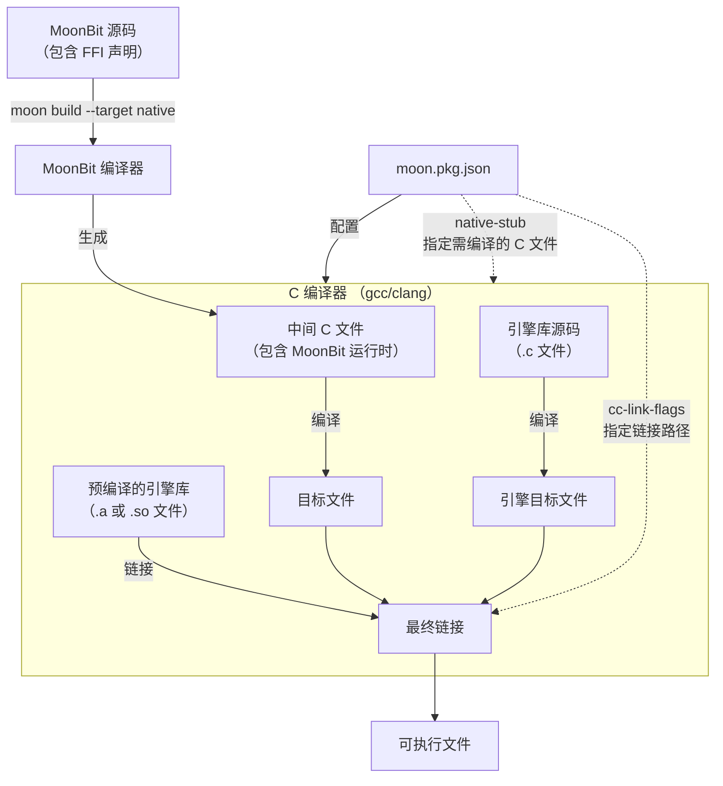

您的理解**基本正确**，对于 `FuncRef[_]`、WasmGC 和 FFI 的定位描述是准确的。不过，其中关于“通过 FuncRef 实现 JIT 动态调用底层引擎”的个别细节描述，与 MoonBit 的实际设计存在微小偏差。

下面是针对您结论中三个要点的核对与修正：

### 1. 关于 `FuncRef[_]` 与动态调用——✅ 正确但有重要补充

您提到“利用 `FuncRef[_]` 实现动态调用”这一点是正确的。MoonBit 的 `FuncRef[_]` 类型确实专门用于**向外部（FFI）传递回调函数**，是宿主代码与 MoonBit 交互的关键机制。

**但有一个重要补充需要您注意：** `FuncRef[_]` **并非**直接在 MoonBit 内部用于“动态执行从外部加载的 Wasm 字节码”。它的核心定位是**安全的跨语言回调**：
*   **限制**：`FuncRef[T]` 要求函数**不能捕获外部变量**（必须是闭合函数），否则会编译报错。
*   **机制**：当您将 MoonBit 函数传给 C 或 Wasm 宿主时，MoonBit 运行时通过 `moonbit:ffi.make_closure` 将函数指针与上下文绑定，生成宿主可调用的函数句柄。

简单说，`FuncRef` 是 MoonBit 代码**被外部调用**的“桥梁”，而非在 MoonBit 内部充当“JIT 引擎”去执行任意 Wasm 字节码。

### 2. 关于 WasmGC 内存管理——✅ 完全正确

您对 “Wasm-first” 和 WasmGC 的描述**非常准确**。MoonBit 确实针对 WasmGC 提案进行了深度优化，实现了自动内存管理，契合 Wasm 指令集特性。在设计理念上，这确实能让 MoonBit 在沙箱环境中更安全、高效地运行。

### 3. 关于“零负担 FFI”——✅ 方向正确

您提到通过 FFI 对接 C/C++ 引擎库（如 WAMR）**思路完全可行**，MoonBit 确实提供了 FFI 机制来调用外部函数。

**但需要澄清“零负担”的含义**：这里的“零负担”更多指**语法上的轻量**（只需 `extern` 声明即可）和**调用开销低**，并非指 MoonBit 能自动将复杂的 C Wasm 引擎库“翻译”成 MoonBit 代码。您依然需要自行处理 Wasm 二进制解析、实例化等底层逻辑（或封装现有 C 库）。

### 总结修正

您的结论在核心技术点（`FuncRef`、WasmGC、FFI）上是**成立**的。若要让描述更严谨，可修正为：

> “MoonBit 内嵌 Wasm 运行时的正确技术路径是：**利用 `FuncRef[_]` 作为向宿主环境暴露回调的安全句柄**，**基于 WasmGC 实现高效的自动内存管理**，并通过**零负担 FFI** 调用底层的 C/C++ Wasm 引擎库（如 WAMR）来完成字节码解析与执行。”

如果希望进一步探讨在 MoonBit 中如何具体封装某个 C Wasm 引擎库，或者需要实现 `FuncRef` 回调的代码示例，可以随时告诉我。

**需要编译，但“是否提前编译好”取决于你链接库文件的方式（静态库 `.a` / 动态库 `.so`）还是源代码。**

MoonBit 的 FFI 并不会自动帮你编译引擎库，它依赖于传统的 C 工具链（如 `gcc`、`clang`、`ar`）来处理底层的编译链接。你可以通过以下两种方式来处理：

### 1. 链接已编译的静态库或动态库（最常见）

如果你的 Wasm 引擎库已经被编译成了 `.a`（静态库）或 `.so`/`.dll`（动态库）文件，你需要在 `moon.pkg.json` 中使用 `cc-link-flags` 告诉链接器去哪里找这些文件。

**配置示例（假设 WAMR 已安装在系统路径）：**
```json
{
  "link": {
    "native": {
      "cc-link-flags": "-L/usr/local/lib -lwamr"
    }
  }
}
```
*   `-L`：指定库文件的搜索路径。
*   `-l`：指定要链接的库名（链接器会自动加上 `lib` 前缀和 `.a`/`.so` 后缀）。

### 2. 在项目中编译源码（如果你有 `.c` 文件）

如果你只有 WAMR 的源码（`.c` 文件），你可以把它们直接放在 MoonBit 项目中，通过 **`native-stub`** 字段让 MoonBit 帮你编译。

**操作步骤：**
1.  将 WAMR 的 `.c` 源文件复制到你的 MoonBit 包目录下。
2.  在 `moon.pkg.json` 中配置：
```json
{
  "native-stub": ["wasm_runtime.c", "wasm_loader.c"]
}
```
3.  MoonBit 在执行 `moon build --target native` 时，会自动调用 `gcc`/`clang` 将这些 C 文件编译成目标文件，再链接进最终的可执行程序。

---

### 核心流程总结：MoonBit FFI 编译全过程

无论哪种方式，本质上都需要经过编译。下图可以让你更清晰地看到整个流程：



### 一个关键点：区分“编译给谁用”

在上一轮对话中，你提到“零负担 FFI 调用底层的 C/C++ Wasm 引擎库（如 WAMR）”。

*   **WAMR 需要编译**：它是一个 C 语言编写的虚拟机，必须变成机器码（.o 或 .a）才能被 CPU 执行。
*   **MoonBit 的调用机制**：MoonBit 通过 C FFI 声明函数原型，编译后生成对应的 C 代码（如 `iwasm_runtime_init()`），再由链接器将 MoonBit 生成的代码与 WAMR 的代码合并成一个文件。

简单来说，**MoonBit 并不是“解释执行”C 代码，而是把 C 代码和 MoonBit 代码一起“翻译”成二进制文件**。

### 快速上手建议

如果你想亲自验证，可以按以下步骤尝试：

1.  **获取 WAMR**：从 GitHub 下载 [wasm-micro-runtime](https://github.com/bytecodealliance/wasm-micro-runtime) 源码，使用 CMake 编译生成 `libvmlib.a`。
2.  **配置 MoonBit 项目**：
    *   将 `libvmlib.a` 放入 `lib` 文件夹。
    *   在 `moon.pkg.json` 中写入：
        ```json
        {
          "link": {
            "native": {
              "cc-link-flags": "-L./lib -lvmlib -lm"
            }
          }
        }
        ```
3.  **编写胶水代码**：创建 `c_wrapper.c` 包含 WAMR 头文件，并通过 `native-stub` 引入。

有任何具体配置问题，或者卡在某一步编译错误上，欢迎随时告诉我。