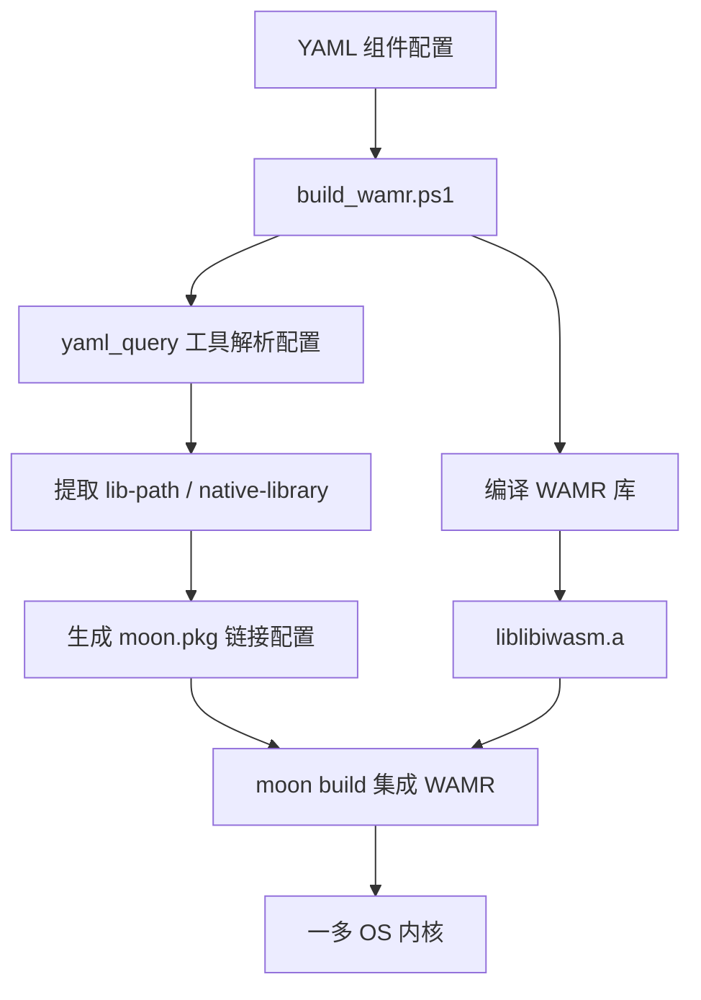

# wamr 包 — WAMR 运行时集成

**路径**: `runtime/wamr/`  
**依赖**: `core`、`component`

## 概述

wamr 包集成 **WAMR（WebAssembly Micro Runtime）**，为一多 OS 提供 WASM 组件执行能力。采用 **双模架构**：在真实 WAMR 库可用时使用原生运行时，否则降级为 stub 模式。

设计目标：
- **用户可配置**：通过 YAML 组件配置声明 WAMR 的库路径、系统依赖
- **编译期自动检测**：`__has_include` 在编译时决定模式
- **自举**：构建参数从组件定义派生，不硬编码

---

## 双模架构

```
                    ┌─────────────────┐
                    │   WasmRuntime    │  (component 包定义)
                    │   函数表接口      │
                    └────────┬────────┘
                             │
              ┌──────────────┴──────────────┐
              ▼                             ▼
    ┌─────────────────┐           ┌─────────────────┐
    │   真实模式       │           │   Stub 模式      │
    │ (real mode)     │           │ (stub mode)      │
    ├─────────────────┤           ├─────────────────┤
    │ WAMR 库链接      │           │ 纯 MoonBit 模拟   │
    │ liblibiwasm.a   │           │ 无 C 依赖         │
    │ 完整 WASM 执行   │           │ 返回模拟结果       │
    │ 硬件边界检查      │           │ 适合测试场景       │
    └─────────────────┘           └─────────────────┘
```

### 模式选择

编译期通过 `wamr_config.h` 中的 `WAMR_AVAILABLE` 宏控制：

```c
// wamr_config.h（由 build_wamr.ps1 生成）
#define WAMR_AVAILABLE 1   // 真实模式，链接 WAMR 库
// #define WAMR_AVAILABLE 0  // Stub 模式
```

**编译时检测逻辑**（MoonBit `moon.pkg` 中的 `if` 条件）：

```
if WAMR_AVAILABLE:
  添加 -DWAMR_AVAILABLE 编译宏
  链接 -lliblibiwasm.a
  链接系统库（ws2_32, ntdll 等）
else:
  不链接 WAMR 库
  使用纯 MoonBit stub 实现
```

---

## 公开 API

### `create_wamr() -> @component.WasmRuntime`

创建 WAMR 运行时实例，返回 `WasmRuntime` 函数表。

```moonbit
pub fn create_wamr() -> @component.WasmRuntime
```

真实模式下，该函数调用 C FFI：

```moonbit
extern "C" fn _wamr_runtime_init() -> Unit = "wamr_runtime_init"
extern "C" fn _wamr_module_load(bytes: Array[Byte], len: Int) -> Int = "wamr_module_load"
extern "C" fn _wamr_module_instantiate(slot: Int) -> Int = "wamr_module_instantiate"
extern "C" fn _wamr_module_unload(slot: Int) -> Unit = "wamr_module_unload"
```

返回的 `WasmRuntime` 包含四个核心操作：

| 字段 | C 后端函数 | 说明 |
|------|-----------|------|
| `invoke` | `wamr_function_invoke` | 调用 WASM 导出函数 |
| `register` | `wamr_module_load` + 实例化 | 注册 WASM 模块 |
| `load` | `wamr_module_load` + 实例化 | 加载模块到实例 |
| `deallocate` | `wamr_module_unload` | 卸载模块 |

---

## C FFI 适配层

### `c_src/wamr_adapter.c`

提供 MoonBit FFI 调用的 C 侧实现，包含双模切换逻辑：

```c
// 头文件检查模式
#if __has_include("wasm_export.h")
  #define WAMR_AVAILABLE 1
  #include "wasm_export.h"
#else
  #define WAMR_AVAILABLE 0
#endif
```

**核心 C 函数**：

| C 函数 | 说明 |
|--------|------|
| `wamr_runtime_init` | 初始化 WAMR 引擎（`wasm_runtime_init`） |
| `wamr_module_load` | 加载 WASM 字节码（`wasm_runtime_load`） |
| `wamr_module_instantiate` | 实例化模块（`wasm_runtime_instantiate`） |
| `wamr_function_invoke` | 调用函数（`wasm_runtime_call_wasm`） |
| `wamr_module_unload` | 卸载模块（`wasm_runtime_unload`） |

### 槽位管理

使用预分配数组管理多模块：

```c
#define MAX_MODULES 32

typedef struct {
  wasm_module_t module;
  wasm_module_inst_t instance;
  bool loaded;
} WamrModuleSlot;

static WamrModuleSlot slots[MAX_MODULES];
```

- 加载返回 slot id
- 后续操作通过 slot id 定位模块
- 卸载后 slot 可复用

---

## moon.pkg（动态生成）

由 `build_wamr.ps1` 根据 YAML 组件配置动态生成：

```moonbit
import {
  "username/yiduo/runtime/core",
  "username/yiduo/runtime/component",
}

options(
  deps: [ ],
  "native-stub": [ "c_src/wamr_adapter.c" ],
  link: {
    native: {
      "cc-link-flags": [
        "-L../../target",
        "-lliblibiwasm.a",
        "-Wl,--whole-archive",
        "-Wl,--no-whole-archive",
      ],
      "cc-flags": [ "-DWAMR_AVAILABLE" ],
    },
  },
)
```

**链接选项说明**：

| 选项 | 说明 |
|------|------|
| `-L../../target` | WAMR 静态库路径 |
| `-lliblibiwasm.a` | WAMR 运行时库 |
| `-Wl,--whole-archive` | 强制包含所有符号 |
| `-DWAMR_AVAILABLE` | 启用真实模式 |

---

## 构建流程



---

## 与 008 组件配置规范的关系

wamr 组件的标准配置：

```yaml
# configs/components/wamr-runtime.yaml
components:
  wamr-runtime:
    type: native
    description: "WAMR wasm runtime"
    properties:
      max-modules: 32
    source:
      type: cmake
      native-library: runtime/wamr/target/liblibiwasm.a
      lib-path: runtime/wamr/target
    system-libs:
      windows: [ws2_32, ntdll]
      linux: [dl, pthread, m]
      macos: [dl, pthread, m]
```

---

## 设计决策

| 决策 | 选择 | 理由 |
|------|------|------|
| 集成方式 | C FFI 静态链接 | 零运行时依赖，与内核一体编译 |
| 模式选择 | 编译期 `__has_include` | 零运行时开销，无动态检测 |
| 库链接策略 | `--whole-archive` | 解决 WAMR 符号未正确导出的问题 |
| 配置驱动 | YAML → build_wamr.ps1 | 符合自举原则，不硬编码路径 |
| 测试模式 | stub 模式 | 测试无需 WAMR 库，CI 友好 |